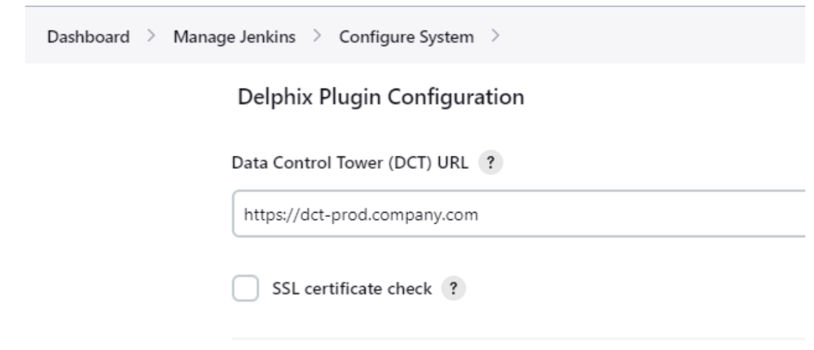
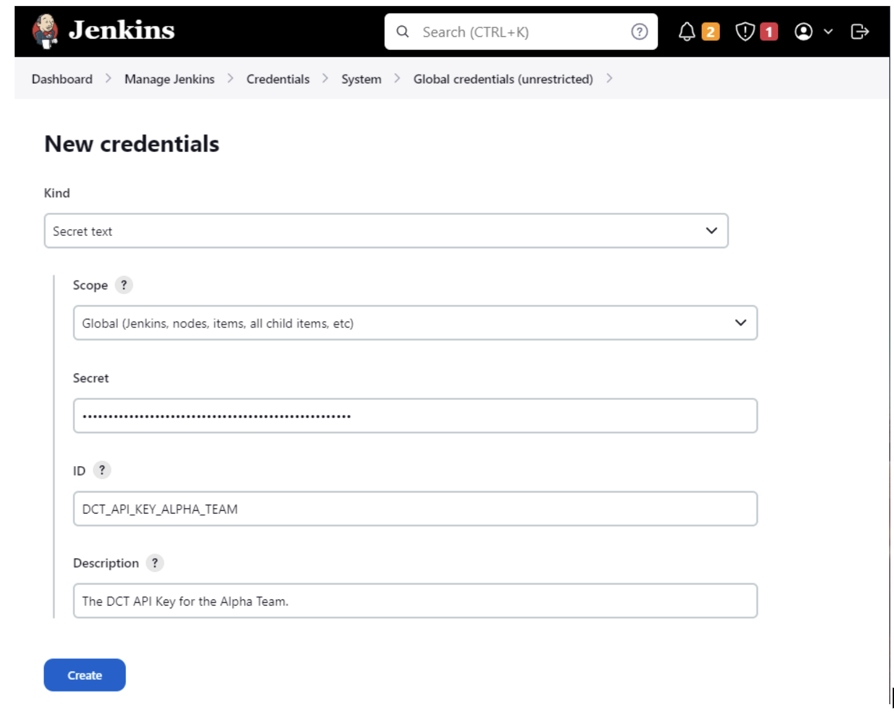
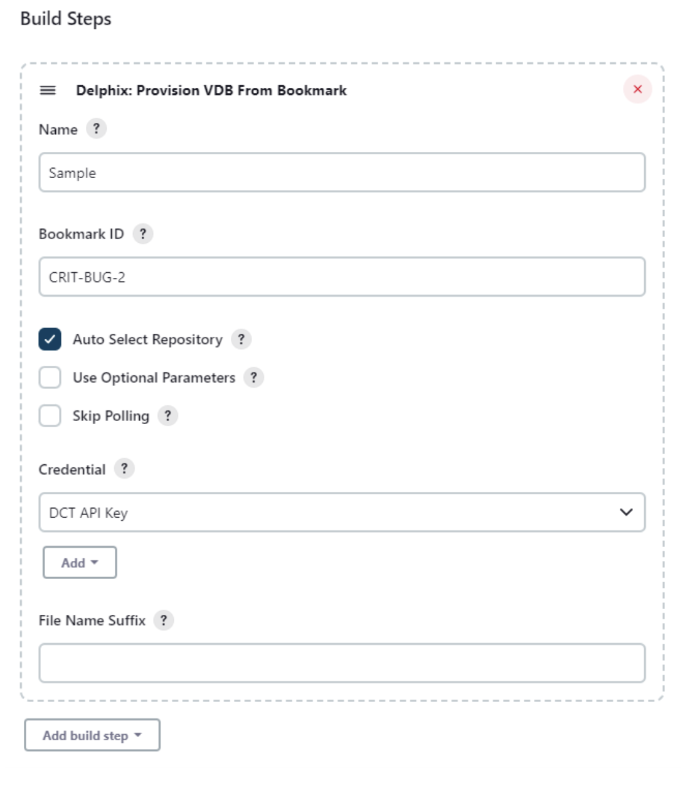

# Delphix Plugin

[](https://ci.jenkins.io/job/Plugins/job/delphix-plugin/)
[](https://plugins.jenkins.io/delphix)
[](LICENSE)

The Delphix plugin allows Jenkins to connect to Delphix DevOps Data Platform(s) and execute data operations using the Data Control Tower (DCT) APIs.

#### Table of Contents
1.  [Introduction](#Introduction)
2.  [Installation](#installation)
3.  [Pre-Requisites](#requirements)
4.  [Usage](#usage)
5.  [Links](#links)
6.  [Contribute](#contribute)
    *   [Code of conduct](#code-of-conduct)
    *   [Community Guidelines](#community-guidelines)
    *   [Contributor Agreement](#contributor-agreement)
7.  [Reporting Issues](#reporting-issues)
8.  [Statement of Support](#statement-of-support)
9.  [License](#license)

## <a id="Introduction"></a>Introduction

The Jenkins Plugin enables teams to integrate the Delphix DevOps Data Platform within their automated pipelines. With Jenkins and Delphix, customers can automatically provision and destroy ephemeral data environments quickly to improve automated testing and automatically resolve common IT requests. Teams who successfully integrate the solution within their pipelines have experienced improved application quality, faster delivery cycles, and ultimately happier teams and customers. The plugin leverages the Data Control Tower (DCT)’s APIs to communicate with the Delphix Engines. 

### Example Use Cases
- Provision an Oracle database and send the connectivity information to a Quality Assurance team member via email, Slack, or Teams.
- Provision a PostgreSQL database, attach a test Application, run a Selenium or JUnit testing plan, report the results, and then destroy the database.
- Provision Oracle and MySQL databases simultaneously to complete manual integration testing.
- Destroy all Microsoft SQL Server databases at a specific time on a specific day every, week.


## <a id="installation"></a>Installation

Install through Jenkins Plugin Manager or download [here](https://plugins.jenkins.io/delphix).

## <a id="requirements"></a>Pre-Requisites

- Jenkins server version 2.361.4 or greater.
- Delphix Data Control Tower v7.0.1 or greater
- One or more connected Delphix Continuous Data Engines v6.0.14.2 or greater.
[Consult our DCT documentation for more information](https://dct.delphix.com/docs).
  


## <a id="usage"></a>Usage

#### **Global Configuration**

After the plugin has been installed, DCT will need to be connected. Go to Manage Jenkins > Configure System, scroll down to the Delphix section, and enter your DCT URL. This URL will be automatically used for every plugin step on the Jenkins server.

Select the `SSL certificate check` checkbox if the DCT server has an insecure SSL Certificate. 
<br/>*We recommend configuring your DCT server with an SSL certificate for production usage.



#### **Credentials**

The Delphix Plugin uses an API Key to run commands against the DCT server. We recommend granting this key access to only the Objects and Actions that it requires using the Principle of Least Privilege. The API Key is created and managed directly within the DCT server. More information can be found in DCT’s documentation.

[More information can be found in DCT’s documentation](https://dct.delphix.com/docs).

The API KEY has to be saved on Jenkins’s side as a Secret text. In Jenkins, go to Credentials > Global > Add Credentials, select the Secret text type, and fill in the inputs



More than one set of API Keys can be specified within your Jenkins server. Simply call the desired Credential ID in your Jenkins jobs. We recommend creating keys for specific teams, individuals, or purposes.

#### **Plugin Steps**

We offer a handful of steps in the Delphix plugin. All steps can be configured through the Freestyle Project UI builder or Pipeline scripting.

*   Provision VDB From Snapshot (provisionVDBFromSnapshot) - Create an Oracle, Microsoft SQL Server, PostgreSQL, and other databases from a Delphix Snapshot.
*   Provision VDB From Bookmark (provisionVDBFromBookmark)- Create an Oracle, Microsoft SQL Server, PostgreSQL, and other databases from a Data Control Tower Bookmark.
*   Delete VDB (deleteVDB) - Shutdown and destroy a provisioned VDB.



All steps leverage DCT APIs. Many advanced properties can be configured by identifying the matching DCT API and specifying the values in the “Additional Values” field.

#### **Advanced Settings**
It is possible to share assets created between build steps. The provision operation has its output saved in a properties file.

*   Jenkinsfile Script - All steps can be run through the Jenkins pipeline. We highly recommend using the [Snippet Generator] (https://www.jenkins.io/doc/book/pipeline/getting-started/#snippet-generator) to help construct your commands. Below we’ve presented a few samples to help you get started. 

Provision VDB from Bookmark Example:-

```  
provisionVDBFromBookmark  name: 'BMKSAMP', bookmarkId: '<Input Bookmark ID>', autoSelectRepository: true, credentialId: '<Input DCT Key 1.abc1234567890>'
```  

Provision VDB From Bookmark and dynamically resolve API Key Example:-

```  
withCredentials([string(credentialsId: 'DCT_API_KEY', variable: 'KEY')]) {
      	provisionVDBFromBookmark  name: 'KEYSAMP', bookmarkId: '<Input Bookmark ID>', autoSelectRepository: true, credentialId: '${KEY}',
} 
```  

Provision VDB From dSource Example:-
```  
provisionVDBFromSnapshot  name: 'dSrcSAMP', sourceDataId: '<Input dSource ID>', autoSelectRepository: true, credentialId: '<Input DCT Key 1.abc1234567890>'  
```  

*   Properties File - This file allows the sharing values between build steps. The provision operation has its output saved in a properties file and the name this file can be updated to maintain multiple within a single Jenkins job. The Delete VDB step can call upon this properties file automatically. [Additional details about Properties File usage can be found in this video] (https://www.youtube.com/watch?v=qQS7Idaq_ME).

Delete VDB From Properties File Example:-

```  
deleteVDB loadFromProperties: true, credentialId: '<Input DCT Key 1.abc1234567890>' 
```  
 

## <a id="links"></a>Links

*   [Delphix Plugin Jenkins Wiki Page](https://wiki.jenkins.io/display/JENKINS/Delphix+Plugin)
*   [Jenkins Plugin Delphix Page](https://plugins.jenkins.io/delphix)

## <a id="contribute"></a>Contribute

1.  Fork the project.
2.  Make your bug fix or new feature.
3.  Add tests for your code.
4.  Send a pull request.

Contributions must be signed as `User Name <user@email.com>`. Make sure to [set up Git with user name and email address](https://git-scm.com/book/en/v2/Getting-Started-First-Time-Git-Setup). Bug fixes should branch from the current stable branch. New features should be based on the `master` branch.

#### <a id="code-of-conduct"></a>Code of Conduct

This project operates under the [Delphix Code of Conduct](https://delphix.github.io/code-of-conduct.html). By participating in this project you agree to abide by its terms.

#### <a id="contributor-agreement"></a>Contributor Agreement

All contributors are required to sign the Delphix Contributor agreement prior to contributing code to an open source repository. This process is handled automatically by [cla-assistant](https://cla-assistant.io/). Simply open a pull request and a bot will automatically check to see if you have signed the latest agreement. If not, you will be prompted to do so as part of the pull request process. Read the full [Delphix Contributor License Agreement](https://delphix.github.io/contributor-agreement.html).

## <a id="reporting_issues"></a>Reporting Issues


Please submit bug reports, suggestions and pull requests to the [GitHub issue tracker](https://github.com/jenkinsci/delphix-plugin/issues).

## <a id="statement-of-support"></a>Statement of Support

This software is provided as-is, without warranty of any kind or commercial support through Delphix. See the associated license for additional details. Questions, issues, feature requests, and contributions should be directed to the community as outlined in the [Delphix Community Guidelines](https://delphix.github.io/community-guidelines.html).

## <a id="license"></a>License

This is code is licensed under the Apache License 2.0. Full license is available [here](./LICENSE).
